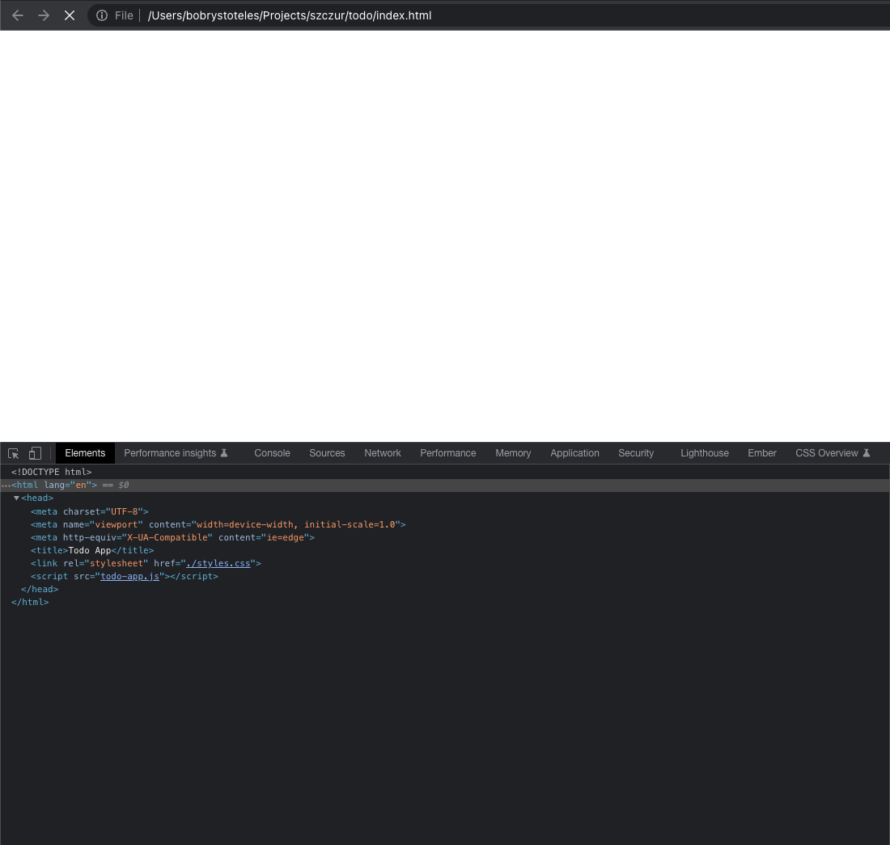

## Lesson 2 on building interactive website

Related changes: https://github.com/BobrImperator/todo-app/pull/1/files

**Notice**
Some code explanation will be included in the code snippets as comments.
Remember that in javascript a comment is created with two backward slashes `//`.
The comments most of the time will refer to the line below them.

## Lexicon

#### Assignment
```js
// Create a variable called 'count' and `assign` 0 to it.
let count = 0;
console.log(count) // 0

// Assign 3 to the 'count' variable
count = 3;
console.log(count) // 3
```

https://developer.mozilla.org/en-US/docs/Web/JavaScript/Reference/Operators/Assignment
#### Mutable value - Mutation - Mutability
The act of 'mutation' often can be understood as simply changing a value of some property.
Especially if the given value is an object or an instance of a class.

**class instances and objects share the way we work with them, change their properties, call their methods.
For now feel free to completely treat them in the same way, but remember that they DO have different functions and uses.**

So basically "to mutate" means "to change" or even considering the above section - "to assign".

So let's say I'd ask you "mutate a 'count' property"
The answer would be:
```js
// Assign, Mutate, Change 'count' property to a value of 4
count = 4;

// Assign, Mutate, Change 'count' property to a value of count + 1
count = count + 1;
```

Let's say I'd ask you to "change the 'name' of todo"
```js
// Create a variable called 'todo' and assing it a value of new TodoItem,
// this creates an instance of the TodoItem class.
let todo = new TodoItem();

// Assign, Mutate, Change 'name' property of 'todo' to a value of "Do dishes"
todo.name = "Do dishes";
```
So the above can be read in several ways:
"Change todo's 'name' property"
"Mutate todo's 'name' property"
"Mutate todo"
"Assign a new value to 'name' property of 'todo' variable"

https://developer.mozilla.org/en-US/docs/Glossary/Mutable


## Ideally script tags should be in the `<head></head>` of the document

In this lesson, one of the changes is that we've moved the `script` tag from the document body
to the document head.

There can be some cases where having a `script` tag inside body might be useful e.g. when it's some Third-Party 'module'
that you'd like to load _sometime after_ your application is already running.
Most of the time however, especially when working with frameworks all of the javascript is loaded before anything else
because it's required for your application to function at all as nowadays all of the HTML is created 'on the fly' with Javascript (client-side rendering).
Unlike before when it was the server sending over complete HTML document (server-side rendering).

Given all that, we can go back to the todo-app.
So as mentioned, we've moved the `script` tag from the `body` to the `head`.

But this creates an issue:
```js
Uncaught TypeError: Cannot read properties of null (reading 'lastChild')
    at TodoApp.renderTodos (todo-app.js:16:17)
    at new TodoApp (todo-app.js:9:10)
    at todo-app.js:44:3
```
The application stopped working, so what's going on?!

I don't want to dig into it too much *yet*, but know this: figuring this kind of stuff is pretty much 80% of a job of a programmer - trying to figure out what some error is, where it comes from and what causes it.
I'll try to tackle this in some future lessons.

Well, a thing to consider is that the browser is "parsing" the `document` (index.html) in top-to-bottom manner.
Meaning that the javascript is loaded and run **before** any content inside the document's `body`.
Which we rely on inside `renderTodos` method, because this is where we try to find the element with "element-all-todos" attribute,
but because the element doesn't exist yet, the `document.querySelector` returns `null`.
So once we try to access some property on `null`, in this case "lastchild" - the application crashes.

We can check this by using `debugger` and adding it right above the `new TodoApp()` line. 
It is a special keyword that stops browser from processing anything when it "encounters" a `debugger` in code. 




As shown, our "index.html" file is only parsed to the point when our javascript is loaded and nothing more.
And our application fails because we try to reference an element that doesn't exist.

Luckily, browser emits a lot of useful events that we can use to avoid this problem.
The event we're looking for is called "DOMContentLoaded", the browser emits it only **after** the whole document is parsed and ready.

```js
// todo-app.js
// Register 'EventListener' for 'DOMContentLoaded' event on the document element,
// provide a handler function as second argument to the `addEventListener` method.
// provide additional option as third argument tot the `addEventListener` method
// it configures the 'EventListener' to call our function only 'once' and detach itself from the document element,
// so it never runs again.
document.addEventListener('DOMContentLoaded', () => {
  // Initialize TodoApp class
  // This creates an Instance of a TodoApp
  new TodoApp();
}, { once: true });
```

So similarly to the "submit" event on the form element, we add an 'eventListener' on the `document` directly,
inside it `initialize` the application and additionally we pass it additional option `once: true` which will make it so
the function runs only "once" and it can remove/detach the event listener so it won't be run again just in case.

A thing to consider here is that, even though the "DOMContentLoaded" is very useful,
if we are creating and rendering the HTML elements client-side (with javascript).
We shouldn't rely on the elements that are in the document, so later on we'll change the code to reflect that.

## Creating new Todos

Now we'll implement a form that will let us create more todos.
Let's start off by calling a method called `formComponent` inside the `constructor` of TodoApp `class`:

```js
  // todo-app.js
  constructor() {
    // calls the formComponent method
    // Remember that `this` refers to the instance of TodoApp class.
    // You don't need to pay too much attention to what instance exactly is,
    // just remember that `this` is a special keyword that let us refer to the class.
    this.formComponent();
  }
```

and for `formComponent` method implementation:
```js
  // todo-app.js
  formComponent() {
    // Query the document for element with attribute element-form
    const todoForm = document.querySelector("[element-form]");
    // Register 'EventListener' for 'submit' event on the form element,
    // provide a handler function as second argument to the `addEventListener` method.
    todoForm.addEventListener("submit", (event) => {
      // call 'preventDefault' method on Event object.
      // We'll go through as for why it's needed later.
      event.preventDefault();

      // Get data from the form using FormData class.
      // When FormData is initialized, it takes an additional argument to it's constructor,
      // the argument being a form element which we can get from Event object by reading 'target' property.
      const formData = new FormData(event.target);

      // Initialize a new TodoItem
      let newTodo = new TodoItem();
      // assign a value to 'name' property of newTodo
      // the value being the return value of `formData.get("name")` method.
      // The get method argument being a value of name attribute,
      // in this case name="name".
      newTodo.name = formData.get("name");

      // Push the newly created newTodo to this.todos array
      this.todos.push(newTodo);

      // Call renderTodos method, which wil re-render the todo lists.
      this.renderTodos();
    });
  }
```

It's a pretty small function, but there's a bit going on

```html
    <!-- index.html -->

    <!-- Create form element and give the element an attribute called element-form-->
    <form element-form>
      <!--
        Create input element inside the form 
        set "type" attribute to "text", this will tell the browser what kind of input it should render.
        set "name" attribute to "name", this will let us refer to the input value inside javascript i.e - formData.get("name")
      -->
      <input type="text" name="name" />

      <!--
        Create a button element, and set "type" attribute to "submit"
        this will tell the browser that it should "submit" the form, and emit a SubmitEvent when the button is clicked.
      -->
      <button type="submit">
        Submit
      </button>
    </form>
```

https://developer.mozilla.org/en-US/docs/Web/API/FormData
https://developer.mozilla.org/en-US/docs/Web/API/Event/preventDefault
https://developer.mozilla.org/en-US/docs/Web/API/EventTarget/addEventListener
https://developer.mozilla.org/en-US/docs/Web/Events
https://developer.mozilla.org/en-US/docs/Web/API/Document/DOMContentLoaded_event
