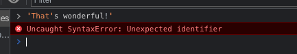
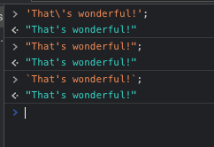

# Syntax Cheatsheet

One of the biggest hurdles when learning any language be it programming one or human(?) is syntax,
when I was making my first steps, one of the best repos that helped me was airbnb's styleguide https://github.com/airbnb/javascript.

I'll try to create a cheatsheet for noobs too as Javascript has a few ways to define and work with functions, methods etc.

## Primitive values a.k.a Scalar values

To put it simply, primitive value is a kind of value that is it's own reference.
We'll look into the specifics of references later together with object and arrays,
for now though, a good connection to make is that objects or arrays can keep other values inside them,
while primitives are standalone and can't be changed, but only something new can be created based on them.

### String

Strings can be created in 3 different ways, they have small differences, but at the end of the day they are a `string` value.

Quotes `""`

```js
"";
```

Single quotes a.k.a Ticks a.k.a Apostrophe `''`

```js
"";
```

Backticks ```` https://en.wikipedia.org/wiki/Backtick

```js
``;
```

#### Examples

Let's see some examples... but things are never easy, I'm sorry.

There's one additional thing to remember regarding strings, you'll notice the use of a Forward Slash `\`.
It's an escaping charachter in Javascript and most other languages.
The most common issue you might run into is when trying to write some English sentence while constructing it with Single Quotes.

```js
'That's wonderful!';
```

If you tried to run this code, you'd get a nice little error.
We didn't launch yet, but "Houston, we've got a problem!"... ALREADY!?.

```js
Uncaught SyntaxError: Unexpected identifier
```



The highlighting helps understand the issue a lot, the problem here is that from the Javascript compiler's standpoint,
you're trying to create a `string` containing `'That'`, then read a variable called `s` and then...
Damn, let's not go into that too deply, all you need to know is that Javascript is confused and it breaks.

There are a few ways to work through it:

Escape the inner Tick:
```js
'That\'s wonderful!';
```

Quotes
```js
"That's wonderful!";
```

Backticks
```js
`That's wonderful!`;
```



This varies between projects, but usually developers tend to use Ticks `''` in their Javascript code,
unless you need to write an English sentence.

...or concatenate...that's what the `Backticks` were invented for, but that's a separate topic.

## Functions
